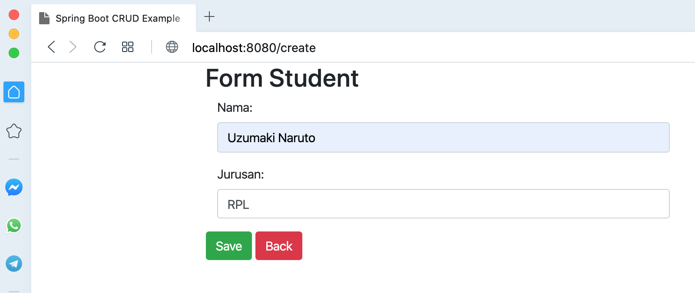
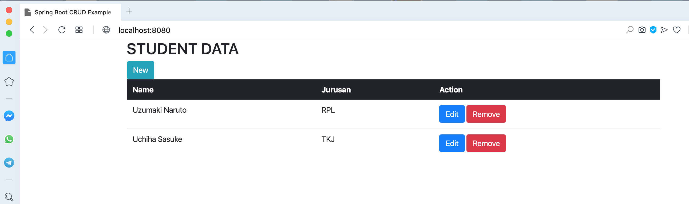

# employee system with springboot, lombok, postgresql and thymleaf

## Things to do
1. Clone the repository: `git clone https://github.com/hendisantika/springboot-thymeleaf-postgres.git`.
2. Go to folder: `cd springboot-thymeleaf-postgres`
3. Run application: `mvn clean spring-boot:run`

## Screen shot

